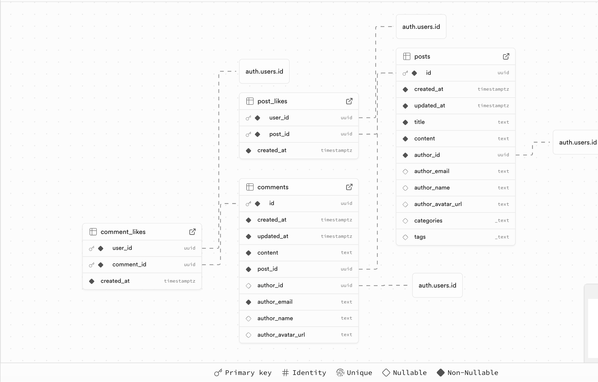
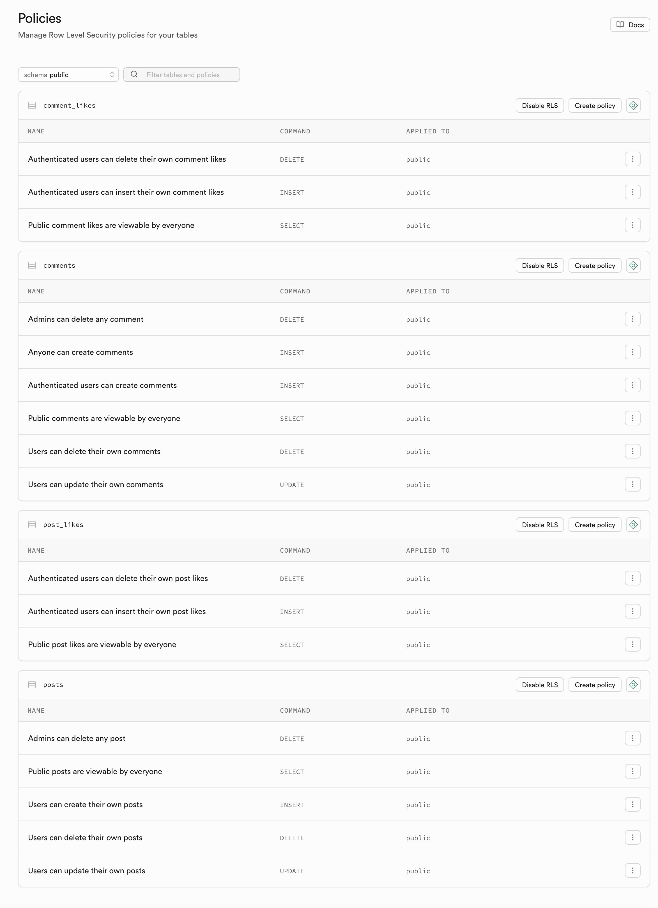

# Project Name: [Insert Name Here]

- **Team Members:**
  - Léon Dalle
  - Romain Barrière
- **Deployed URL:** [https://riftforge-delta.vercel.app/](https://riftforge-delta.vercel.app/ "Link to prod !")

---

## 1. Concept & User Experience

### Key Features (UI/UX)

*Provide a few screenshots or a short animated GIF demonstrating some of the key features of your application.*

The key features of our project are :

* A beautiful Landing Page, crafted with nice colour effects
* An index of every League of Legends Champions,

 

 

---

## 2. Full-Stack Functionality

*Briefly describe how you implemented the core requirements. Keep it concise (1-2 sentences per item).*

### Authentication

- [X] Sign-up implemented
- [X] Sign-in implemented
- [X] Sign-out implemented
- [X] The UI updates based on user state

**Notes**: The auth methods are all setup, and we even have the possibility of authenticating using Discord or Github thanks to Oauth.

**Self-Evaluation:**: The auth processes for the user are straightforward and they work. There may be some shady bugs hiding but they didnt appear in our tests.

### CRUD Operations

- **Main Resource:** The Forum

- [X] Create
- [X] Read
- [X] Update
- [X] Delete

**Notes**: The forum is the main resource, since it use the persistency of Supabase to save the interactions between the users. A user is able to create a new post, to read other posts, to edit his own posts, and he can of course delete them.

**Self-Evaluation:**: We think we have delivered a decent work here, with every feature that were expected. Also, we implemented a like feature, to make the forum more lively.

### Data Relationships

- **Tables Involved:** Users, Posts, Comments, Post Likes and Comments likes.

- [X] Relationship implemented

**Notes**: We have a couple of different tables such as posts and comments, which comments refer by the uuid of each post to link to them. The data relationship between them works the the easiest way, by using unique and long uuid for every posts, and referring to them as foreign keys in the other tables.
**Self-Evaluation:**: Our work on this part of the project was pretty straightforward, we did not make use of outstanding features for the database relationships, though it's crafted well.

### Search & Filtering

- [X] Search implemented
- [X] Filter implemented, available options: [e.g., "by category", "by date"]

**Notes**: We have 2 different serach bars : The one on the landing page, which makes the user able to browse through the champions index, and a search bar for the forum.

the forum search bar makes it easy to find the content you're interested about. It features drop down menus to filter posts only by certain tags or categories.

**Self-Evaluation:**: The features are nice though maybe our plan is unclear : the user may not know what he'll look for in the first search bar, before trying some inputs.
Also, there may not be enough difference between the tags, and the categories.

There could be more thoughts put into this feature.

### External API Integration

- **API Used:** DDragon : https://ddragon.leagueoflegends.com/cdn/
- **Data fetched:** All the pictures of the champions, their data, their name and stats, are based on DDragon.

**Notes**: We have leveraged DDragon's API to fetch all the data required for our champions index and GTC game, by caching the response of their CDN.

**Self-Evaluation:**: We think we have did good on this, but there could be some optimisations. Here all the contents of DDragon are called by the NextJS server, and not the client. it could have been better and different, but it was the best way to implement this easily for us.

---

## 3. Engineering & Architecture

### Database Schema

*Provide a screenshot of your Supabase Table Editor or a text description of your tables and relationships.*

**Notes**: Our database is quite simple

**Self-Evaluation:**: The work we did there is good, not much impressive, but it works well.

### Row Level Security (RLS)

*Provide a screenshot of the **Supabase Authentication > Policies** dashboard showing your active policies. This is mandatory.*

**Notes**:

**Self-Evaluation:**: Our use of RLS is correct, we made sure that only the author of a post or a comment could edit or delete it. Also, only authenticated users can create new posts or comments.

### Server vs. Client Components

*Identify one significant Server Component and one Client Component in your app.*

**Server Component:** [client/app/champions/page.tsx]
    - *Why?* This component fetches data from an external API (DDragon) and renders the champion list on the server side for better performance.

**Client Component:** [client/components/SiteHeader.tsx]
    - *Why?* This component manages user interactions and state, such as displaying the user's authentication status and handling navigation around the app.

---

## 4. Self-Reflection & Feedback

*This section must be completed **individually** by each team member.*

### Proudest Achievement

*What is the technically most difficult or most polished feature you built?*

Léon : [Your answer here]

Romain : [Your answer here]

### What Would You Improve?

*If you had more time, what would you add or improve in your project?*

Léon : [Your answer here]

Romain : [Your answer here]

### Course Feedback (Bonus)

*What did you enjoy about this course? What could be improved for next year?*

Léon : [Your answer here]

Romain : [Your answer here]
